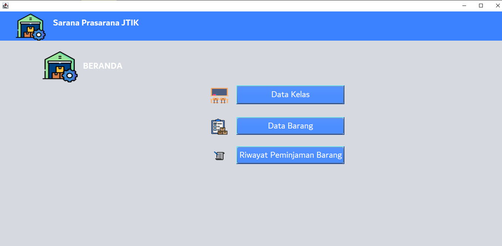

# Sistem Sarana Prasarana JTIK

Welcome to the **Sistem Sarana Prasarana JTIK** project! This system is designed for managing and organizing the facilities and infrastructure within the JTIK department. The project is built using **Java**, **MySQL**, with a desktop-based user interface, and **Ant** as the build tool.

## How to Set Up the Database

To get started, you need to set up the database for this system. Below is an example of how to create a MySQL database for the system, named `saranajtik`.

### 1. Create the Database

```sql
CREATE DATABASE saranajtik;
```

### 2. Create the Tables
This system requires three main tables: datakelas, databarang, and pinjambarang.
```sql
CREATE TABLE datakelas (
    id_kelas INT AUTO_INCREMENT PRIMARY KEY,
    nama_kelas VARCHAR(255) NOT NULL,
    peminjam VARCHAR(255) NULL DEFAULT 'Kosong',
    status enum('Tidak Terpakai','Terpakai') DEFAULT 'Tidak Terpakai'
);
```
```sql
CREATE TABLE databarang (
    id_barang INT AUTO_INCREMENT PRIMARY KEY,
    nama_barang VARCHAR(255) NOT NULL,
    jumlah_total INT NOT NULL,
    jumlah_baik INT NOT NULL,
    jumlah_kurang_baik INT NOT NULL,
);
```
```sql
CREATE TABLE pinjambarang (
  id_pinjam INT NOT NULL,
  nama_barang VARCHAR(255) NOT NULL,
  nama_peminjam VARCHAR(255) NOT NULL,
  jumlah_pinjam INT NOT NULL,
  tanggal_pinjam DATE NOT NULL,
  tanggal_kembali DATE DEFAULT NULL
);
```

### 3. Screenshot or Preview from Project
#### 3.1 Halaman Beranda

#### 3.2 Halaman Data Barang

#### 3.3 Halaman Data Kelas

#### 3.4 Halaman Peminjaman Barang

#### 3.5 Halaman Pengembalian Barang

#### 3.6 Halaman Peminjaman Kelas

#### 3.7 Halaman Pengembalian Kelas


License
This project is licensed under the MIT License - see the LICENSE file for details.
